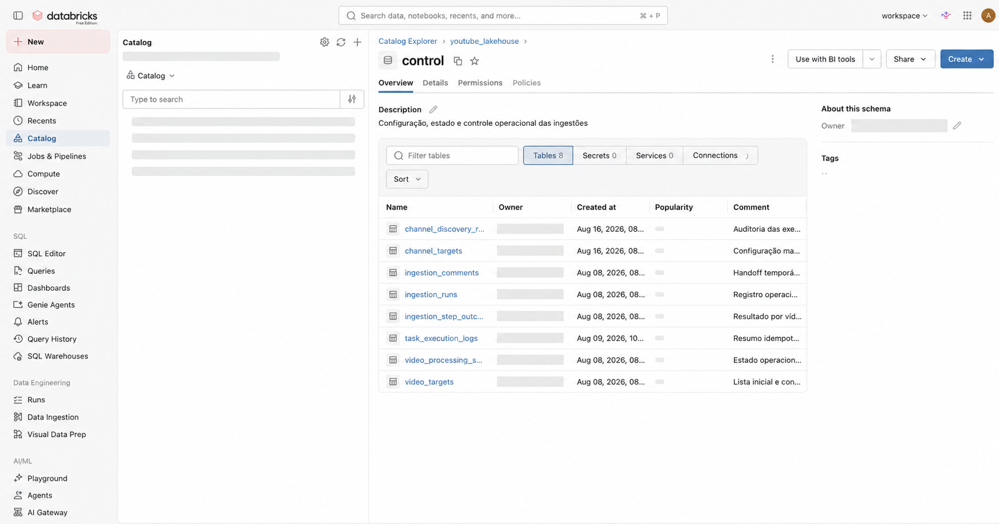
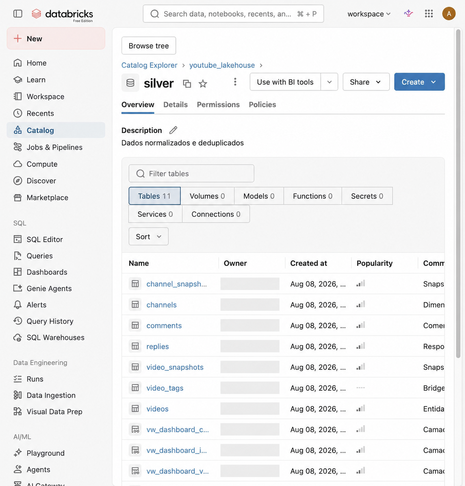
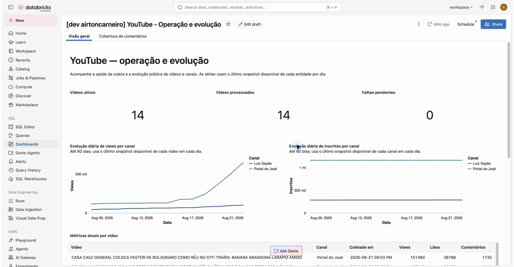

# YouTube GenAI Platform

## Uma plataforma observável para dados públicos do YouTube

O YouTube GenAI Platform é um projeto de engenharia de dados construído no
Databricks para transformar vídeos e canais do YouTube em uma base confiável,
histórica e acompanhável. Em vez de apenas consultar métricas pontualmente, a
plataforma automatiza a coleta, registra a execução de cada etapa e disponibiliza
o resultado em dashboards para decisão e operação.

Ela responde a três perguntas simples:

1. **O que está acontecendo com os vídeos e canais acompanhados?**
2. **Quais conteúdos novos devem entrar no acompanhamento?**
3. **A coleta está funcionando, quanto tempo leva e qual foi o custo de API?**

## Automação que separa descoberta de processamento

O projeto possui dois Jobs independentes no Databricks. Essa separação deixa o
fluxo mais fácil de operar e de explicar:

- **Descoberta de vídeos por canal:** identifica novos vídeos dos canais
  configurados e os coloca na fila de processamento.
- **Ingestão de vídeos:** coleta metadados, contexto do canal, comentários e
  respostas; registra o resultado; e atualiza os dados que alimentam os
  dashboards.


O agendamento automatiza a descoberta diária. Já a ingestão usa uma esteira com
etapas auditáveis: seleciona os vídeos elegíveis, obtém vídeo e canal, coleta as
interações públicas, e finaliza o processamento. Assim, uma falha pode ser
investigada por etapa, sem transformar a operação em uma caixa-preta.

O painel de Jobs também permite verificar o histórico sem iniciar uma execução.
Na apresentação, deve-se priorizar uma execução recente com status `Succeeded` e
usar falhas históricas apenas para explicar a capacidade de diagnóstico.


Essas telas mostram a diferença entre o workflow que processa vídeos e o
workflow que descobre novos vídeos. O histórico de execuções e o agendamento são
evidências operacionais; nenhum Job precisa ser executado durante a leitura.

## Um lakehouse organizado para uso e auditoria

Os dados são organizados no catálogo `youtube_lakehouse`, com responsabilidades
claras em cada camada:

```text
Vídeos e canais configurados
             │
             ├── descoberta automática ──> fila de vídeos
             │
             └── ingestão orquestrada
                       │
                       ├── raw       entrada da API
                       ├── silver    dados normalizados e snapshots históricos
                       └── control   fila, estado, execução e telemetria
                                                    │
                                                    └── dashboards
```

A camada **control** é a visão operacional. Ela mantém, por exemplo, a lista de
vídeos a processar, o estado por vídeo, os resultados por etapa, os logs de
execução e a configuração de descoberta por canal. Isso permite retomar,
diagnosticar e explicar a operação.



Os e-mails de proprietário foram ocultados nesta captura para publicação segura.

Na tela do schema `control`, a lista evidencia tabelas como `video_targets`,
`video_processing_state`, `task_execution_logs`, `channel_targets` e
`channel_discovery_runs`. Cada uma representa uma responsabilidade operacional
específica, em vez de concentrar toda a lógica em uma tabela genérica.

A camada **silver** é a base analítica confiável. Ela reúne vídeos, canais,
comentários e respostas normalizados. Além do estado atual, preserva snapshots
imutáveis das métricas de vídeo e canal. Esse histórico é o que permite mostrar
evolução — não somente um número isolado no momento da consulta.



Os e-mails de proprietário foram ocultados nesta captura para publicação segura.

As views `vw_dashboard_*` formam a camada de apresentação: deixam a consulta dos
dashboards estável e separam o modelo operacional da leitura executiva.

## Visão de produto: operação e evolução

O dashboard **YouTube - Operação e evolução** resume o valor de negócio da
plataforma. Ele apresenta vídeos ativos e processados, falhas pendentes,
evolução diária de visualizações e inscritos por canal, além do detalhe das
métricas atuais de cada vídeo.



Para uma pessoa de negócio, essa tela responde rapidamente se a cobertura está
atualizada e como os canais evoluem. Para uma pessoa técnica, ela evidencia que
as séries são construídas a partir de snapshots diários, preservando a linha do
tempo das métricas públicas.

## Visão de expansão e saúde operacional

Dois dashboards complementam a visão principal:

- **YouTube - Descoberta de vídeos** mostra os canais com descoberta ativa, os
  vídeos cadastrados, falhas de canal, consumo estimado de API e o histórico das
  execuções de descoberta.
- **YouTube - Saúde da ingestão** mostra duração média por tarefa, custo
  estimado de API e o detalhe de cada execução, com status, duração e eventuais
  erros. Seus filtros permitem investigar um período, uma tarefa ou um status
  específico.

Em conjunto, os três dashboards conectam o resultado visível ao usuário com a
qualidade do processo que o gerou: evolução de audiência, entrada de novos
conteúdos e confiabilidade da operação.


O primeiro painel explica a expansão da cobertura; o segundo explica a saúde da
execução. Os números são dinâmicos e devem ser lidos como uma fotografia do
workspace no momento da apresentação, não como valores fixos do projeto.

## Decisões de engenharia que o projeto evidencia

- **Rastreabilidade:** cada execução e etapa deixa registro operacional.
- **Idempotência e retomada:** a fila e o estado de processamento evitam tratar
  a ingestão como uma sequência frágil e descartável.
- **Histórico temporal:** snapshots imutáveis suportam análise de evolução.
- **Separação de responsabilidades:** descoberta de canal e ingestão de vídeo
  são fluxos distintos, conectados por uma fila controlada.
- **Observabilidade:** tempo, status, erros e consumo estimado de API são
  tratados como parte do produto, não apenas como detalhe interno.

## Escopo atual e evolução responsável

O projeto acompanha dados públicos e não armazena transcrições ou legendas de
terceiros. A estrutura `control.video_targets` já suporta a operação de vídeos
alvo, mas uma experiência de cadastro por URL para uma pessoa usuária ainda é
uma evolução a implementar. O schema `gold` também está reservado para futuros
modelos analíticos; ele não deve ser apresentado como uma entrega concluída.

## Conclusão

O YouTube GenAI Platform não se limita a coletar números do YouTube. Ele cria
uma operação repetível e verificável: define o que observar, automatiza a
coleta, preserva a história, mede a saúde do processo e apresenta o resultado de
forma clara. Essa base torna futuras análises e capacidades de IA mais seguras e
mais fáceis de evoluir.
